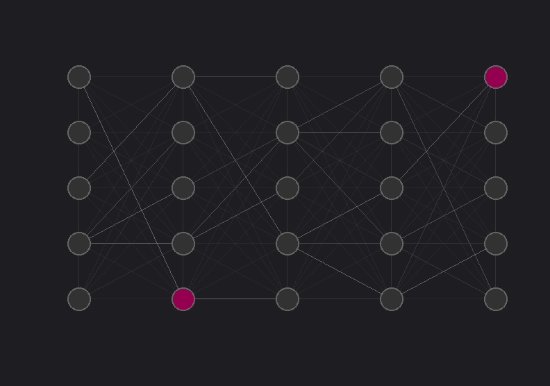

# SNN-STDP-Visualizer


-blue)


A lightweight C++ framework for simulating and visualizing Spiking Neural Networks (SNNs). This project demonstrates the real-time formation of logical neural pathways using feed-forward topologies and synaptic plasticity. 

The application simulates a configurable network of spiking neurons (defaulting to a 5x5 grid) connected in a feed-forward architecture. Users can interact with the network by injecting external stimuli (holding keys 1 through 5) and observe how signal pathways adapt, strengthen and prune themselves dynamically.



*(Real-time visualization of the 5x5 network. Manually injecting spikes into the input layer triggers feed-forward propagation. Notice how active pathways dynamically strengthen due to STDP.)*

## 🧠 Scientific Background & Core Mechanics

The network architecture is built on a foundation of biologically plausible mechanisms combined with highly optimized, **O(1) memory routing** for real-time performance.

### Neuron Dynamics
* **3-Phase State Machine:** Neurons cycle through *Resting* (0), *Firing* (1), and *Refractory* (2) states. Refractory periods are enforced via massive, dynamic threshold multiplication, which organically decays back to baseline sensitivity.
* **Thermodynamic Noise (mEPSPs):** Resting potential is subjected to Gaussian noise, simulating miniature excitatory postsynaptic potentials to prevent network stagnation.
* **Biophysical Limits:** Hyperpolarization is hard-capped at a simulated **Reversal Potential** to prevent lateral inhibition from driving neurons into inescapable negative states. Membrane leak ensures temporal decay of unutilized potential.
* **Adaptive Firing Thresholds:** The action potential threshold is highly dynamic, simulating physiological fatigue. Upon firing, a neuron's threshold undergoes a sharp multiplicative increase, making frequently active neurons temporarily harder to excite. During resting phases, the threshold continuously decays (e.g., by 10% per time step) to regain sensitivity, but is strictly clamped at a baseline minimum.

### Synaptic Plasticity & STDP
The network utilizes a highly performant, **discrete-state Spike-Timing-Dependent Plasticity (STDP)** model:
* **Long-Term Potentiation (LTP):** Causal firing (post-synaptic fires while pre-synaptic is refractory) triggers weight strengthening.
* **Long-Term Depression (LTD):** Anti-causal or perfectly synchronous firing triggers weight depression, actively pruning illogical synaptic pathways. **Receptor Limits:** Synaptic weights are hard-capped to simulate the physiological density limits of postsynaptic **AMPA receptors**.

### Network Homeostasis
To maintain stability across the 5x5 grid, the architecture implements:
* **Lateral Blanket Inhibition:** Static collateral synapses exert strong negative weights within the same layer, enforcing a "Winner-Takes-All" sparsity.
* **L1 Weight Normalization:** Sum-of-absolutes normalization on incoming excitatory weights forces synapses to compete—strengthening one logical pathway mathematically necessitates the weakening of others.
* **Threshold-Induced Pathway Diversification:** Because the network relies on a strict feed-forward topology, signals naturally tend to converge onto the paths of least resistance. The adaptive threshold mechanism counteracts this by temporarily desensitizing highly active nodes. This actively prevents all signal traffic from converging onto a few dominant neurons, forcing the network to establish diverse, parallel logical routes and ensuring a balanced utilization of the entire grid.

## 🛠️ Tech Stack

* **Language:** C++17
* **Build System:** CMake
* **Graphics/UI:** SFML 3.0
* **Testing:** Google Test & CTest
* **CI/CD / Environment:** Docker

## 🚀 How to Run (Local GUI)

To run the visualizer with the graphical interface, compile the project locally on your host machine.

### Prerequisites
* CMake (3.10+)
* A C++17 compatible compiler (MSVC, GCC, Clang)
* **vcpkg** (Package manager to easily install SFML and GTest)
* SFML 3.0 (Installed via vcpkg)

### Build Steps
**Clone the repository:**

```bash
git clone https://github.com/RKornmayer/SNN-STDP-Visualizer.git
cd SNN-STDP-Visualizer
```

**Create the build directory:**

```bash
mkdir build && cd build
```

**Configure the project with CMake:**

Note: Replace `<path-to-vcpkg>` with the actual path to your local vcpkg installation.

```bash
cmake .. -DCMAKE_TOOLCHAIN_FILE="<path-to-vcpkg>/scripts/buildsystems/vcpkg.cmake" -DCMAKE_BUILD_TYPE=Release
```

**Build the executable:**

```bash
cmake --build . --config Release
```

### Run the application:
Depending on your operating system and generator, the executable will be located at:

Windows: `Release\SNN_App.exe`

Linux: `./SNN_App`

Hold keys 1 through 5 while the application is running to manually inject spikes into the first layer!

## 🧪 How to Test (Docker / Headless)
The project includes a fully isolated Docker environment to verify the mathematical and logical integrity of the network (Neurons, Synapses, Net topology) without requiring a GUI or local SFML installation. This runs the Google Test suite via CTest.

**Build the Test Image:**

```bash
# Navigate back to the project root
cd ..
docker build -t snn-framework .
```

**Run the Test Suite:**

```bash
docker run --rm snn-framework
```

Note: The container runs the test matrix and immediately cleans itself up upon completion.